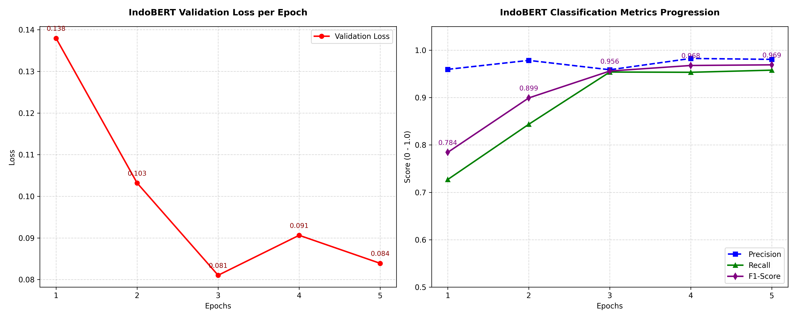
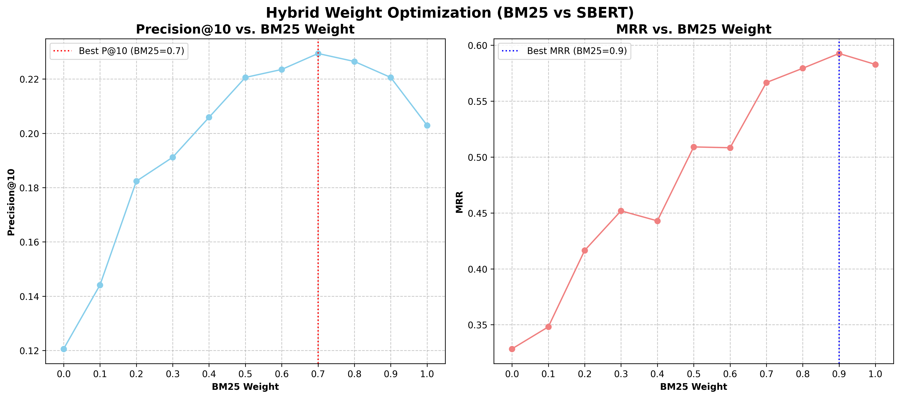
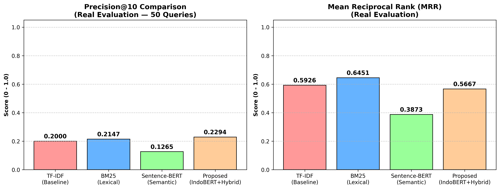

# Pencarian Properti Cerdas (Real Estate Hybrid Search Engine)

### Link Aplikasi: [Aplikasi Streamlit Live](https://hybrid-bert-and-bm25-search-h6ijqfgxyqjzmwivtceoas.streamlit.app)
### Panduan Pengguna: [User Guide](https://bit.ly/4az28c5)
### Google Colab Notebook: [Notebook Colab](https://colab.research.google.com/drive/1Qh6Qfv7v-YkA5iHJvoV-VtQb2cf9Viip?usp=sharing)
### Paper Akademik: [Paper Riset](https://drive.google.com/open?id=1tCHNLOUjywo34QdIN228qKXJgyQh_4Ci&usp=drive_copy)

---

## Identitas Pengembang (Kelompok 8)
Program ini dikembangkan sebagai bagian dari proyek NLP oleh Kelompok 8:

| Nama | NIM |
| :--- | :--- |
| **Filbert Ferdinand** | 535240135 |
| **Arya Rava Pradana** | 535240021 |
| **Rafael Theng** | 535240153 |

---

## Tentang Aplikasi
Pencarian Properti Cerdas adalah mesin pencari real estate (properti) berbasis web yang menggunakan Arsitektur Hybrid modern. Aplikasi ini dirancang untuk mengatasi kelemahan mesin pencari leksikal biasa yang sering kali gagal memahami maksud kontekstual kueri, serta kelemahan model semantik murni yang sering meleset saat mencari detail kata kunci spesifik (seperti nama jalan, stasiun MRT, atau angka harga).

Data properti yang digunakan dalam mesin pencarian ini dikeruk (crawled) secara langsung dari portal real estate terkemuka Indonesia, rumah123.com.

### Cara Kerja Arsitektur Hybrid (Two-Stage Pipeline)
Mesin pencari ini bekerja dalam dua tahapan utama (Two-Stage Retrieval Pipeline):
1. **Tahap 1: Klasifikasi & Penyaringan Keras (Hard Filtering)**
   Aplikasi secara otomatis mendeteksi kriteria mutlak dari teks kueri pengguna (natural language) maupun filter manual sidebar. Kriteria ini disaring menggunakan klasifikasi AI berbasis model **IndoBERT** (`indobert-base-p1`) yang telah difine-tuning secara offline untuk mendeteksi tiga karakteristik biner properti:
   - **Bebas Banjir**: Deteksi wilayah aman banjir berbasis klasifikasi IndoBERT yang digabungkan dengan pencocokan pola **Regex Fallback** untuk akurasi optimal (kolom `Hybrid_Bebas_Banjir`).
   - **Bisa KPR**: Deteksi kesiapan properti untuk program Kredit Pemilikan Rumah (KPR).
   - **Legalitas SHM**: Deteksi kelengkapan hukum berupa Sertifikat Hak Milik (SHM).
   
2. **Tahap 2: Pemeringkatan Lunak (Soft Ranking & Fusion)**
   Setelah kumpulan properti disaring berdasarkan syarat mutlak, sisa kandidat akan dirangking menggunakan kombinasi skor leksikal dan semantik:
   - **Pencarian Leksikal (BM25)**: Mengukur kecocokan kata kunci eksak secara cepat.
   - **Pencarian Semantik (Sentence-BERT)**: Mengukur kesamaan makna kontekstual kueri dengan deskripsi properti menggunakan model `paraphrase-multilingual-MiniLM-L12-v2`.
   - **Global Score Normalization**: Skor dari BM25 dan SBERT dinormalisasi secara global menggunakan metode Min-Max di awal pencarian. Hal ini menjaga konsistensi nilai persentase tingkat kecocokan (Match %) properti meskipun filter dipersempit.
   - **Relevance Threshold**: Menyaring properti yang tidak relevan dengan kueri (di mana skor BM25 bernilai 0 dan tingkat kemiripan kosinus SBERT berada di bawah **0.22**), menjaga kualitas hasil pencarian tetap tinggi.

---

## Fitur Utama

- **Pencarian Bahasa Alami (Natural Language)**: Memungkinkan pencarian properti dengan kueri bahasa sehari-hari.
- **Filter AI Otomatis & Manual**: Deteksi otomatis maksud kueri yang disinkronkan dengan panel checklist di sidebar.
- **Konfigurasi Spesifikasi Fisik**: Slider rentang harga (dalam satuan Miliar Rp), rentang Luas Tanah (LT), dan rentang Luas Bangunan (LB).
- **Pengaturan Bobot AI Interaktif**: Slider dinamis untuk mengatur perimbangan bobot BM25 (Leksikal) dan SBERT (Semantik) secara real-time.
- **Panel Perbandingan Properti**: Fitur interaktif untuk membandingkan spesifikasi dan fitur hingga 4 properti terpilih secara berdampingan.
- **Eksplorasi Detail Properti**: Menampilkan deskripsi lengkap properti secara dinamis beserta tautan langsung ke halaman sumber properti asli.

---

## Arsitektur Data & Direktori
Direktori `data/` melayani dua tujuan utama dalam proyek ini:
1. Menyediakan berkas backend yang menjalankan aplikasi web Streamlit secara langsung (membaca dataset dan model representasi).
2. Berperan sebagai sumber daya (downloadable resource) yang dibutuhkan secara lokal untuk menjalankan berkas Jupyter Notebook (`.ipynb`) maupun Google Colab notebook.

Aplikasi memuat data pra-proses dari direktori `data/` yang harus saling selaras:
* `data/properties_enriched.csv`: Dataset properti dengan fitur prediksi AI offline.
* `data/bm25_index.pkl`: Model indeks BM25 terserialisasi.
* `data/sbert_embeddings.npy`: Array representasi vektor Sentence-BERT.

---

## Pipelines Pengumpulan Data (Scraper)
Proses scraping data dari portal real estate rumah123.com dilakukan menggunakan alur dua tahap:

1. **Pengumpulan Indeks Properti (`scraper/scraper_multicity.py`)**:
   Skrip ini mengambil informasi dasar dari kartu properti di halaman indeks pencarian untuk beberapa kota sekaligus secara berurutan. Data yang diekstrak meliputi nomor halaman, judul properti, teks ringkasan kartu (`text_blob`), dan tautan detail properti. Skrip ini secara otomatis memfilter duplikat dan menggabungkan hasil seluruh kota ke dalam satu file CSV konsolidasi (`BARU_rumah123_multicity_nlp_data.csv`).

2. **Ekstraksi Detail Properti (`scraper/scraper_rumah123_details.py`)**:
   Skrip ini mengambil deskripsi lengkap properti secara otomatis dengan mengunjungi setiap tautan properti dari file CSV konsolidasi sebelumnya. Skrip ini dilengkapi sistem penanganan CAPTCHA otomatis (membekukan tab lain untuk diselesaikan manual oleh pengguna) dan menyimpan progres secara dinamis ke file CSV akhir (`BARU_rumah123_multicity_full_details.csv`).

---

## Hasil Eksperimen & Optimasi Bobot
Berdasarkan evaluasi sistematis menggunakan **50 kueri uji** dan penilaian relevansi manual (Ground Truth), berikut hasil perbandingan performa:

### 1. Perbandingan Kinerja Metode (Benchmark Akhir)
| Metode | Rata-rata Precision@10 | Rata-rata MRR |
| :--- | :---: | :---: |
| TF-IDF (Baseline) | 0.2000 | 0.5926 |
| BM25 (Lexical Only) | 0.2147 | **0.6451** |
| Sentence-BERT (Semantic Only) | 0.1265 | 0.3873 |
| **Proposed (IndoBERT + Hybrid)** | **0.2294** | 0.5667 |

- **Metode Proposed (IndoBERT + Hybrid)** menghasilkan **Precision@10 tertinggi (0.2294)**, menjadikannya metode paling efektif dalam menyajikan properti yang benar-benar relevan dengan kebutuhan pengguna pada halaman pertama.

### 2. Kombinasi Bobot Optimal
Melalui kurva optimasi bobot hibrida, kombinasi optimal dicapai pada:
- **Bobot BM25 (Leksikal)**: `0.7`
- **Bobot SBERT (Semantik)**: `0.3`

---

## Hasil Eksperimen & Visualisasi

Berikut adalah hasil pelatihan model dan analisis pembandingan metode pencarian hibrida yang diusulkan.

### 1. Kurva Pelatihan Model IndoBERT (Fine-Tuning)


### 2. Optimasi Bobot Hybrid (BM25 Weight vs SBERT Weight)
Melalui evaluasi komprehensif pada **50 kueri uji** dengan relevansi manual (ground truth), bobot terbaik ditemukan pada kombinasi **BM25 = 0.7** dan **SBERT = 0.3** yang menghasilkan nilai **Precision@10 = 0.2294** dan **MRR = 0.5667**.



### 3. Perbandingan Performa Evaluasi Akurasi (Benchmark Akhir)
Perbandingan kinerja model yang diusulkan (Hybrid Proposed) terhadap metode baseline lain (TF-IDF, BM25 murni, SBERT murni):

- **TF-IDF (Baseline)**: Presisi Rendah, MRR Rendah.
- **BM25 (Lexical Only)**: Cepat dan tepat untuk kueri eksak, namun kehilangan kedekatan makna kontekstual.
- **Sentence-BERT (Semantic Only)**: Baik dalam memahami makna kalimat tapi terkadang melewatkan detail kata kunci penting (nama stasiun, nomor, dll.).
- **Proposed (IndoBERT + Hybrid)**: Memberikan presisi tertinggi dengan menyaring properti secara cerdas dan merangking sisa hasil pencarian dengan kombinasi leksikal-semantik.



---

## Instalasi & Menjalankan Lokal

### Prasyarat
- Python 3.10 atau versi di atasnya.

### Langkah-langkah
1. **Clone Repositori**:
   ```bash
   git clone https://github.com/username/hybrid-bert-and-bm25-search.git
   cd hybrid-bert-and-bm25-search
   ```

2. **Buat & Aktifkan Virtual Environment**:
   ```bash
   # Windows (PowerShell)
   python -m venv venv
   .\venv\Scripts\Activate.ps1

   # Linux/macOS
   python3 -m venv venv
   source venv/bin/activate
   ```

3. **Instal Dependensi**:
   ```bash
   pip install -r requirements.txt
   ```

4. **Jalankan Aplikasi**:
   ```bash
   streamlit run app.py
   ```
   Aplikasi akan otomatis terbuka pada peramban Anda di alamat `http://localhost:8501`.

---

## Panduan Deploy ke Streamlit Cloud

Aplikasi ini siap dideploy langsung ke **Streamlit Community Cloud**:

1. Pastikan seluruh perubahan kode telah di-push ke repositori GitHub Anda (termasuk folder `data/` yang berisi 3 file utama).
2. Kunjungi [Streamlit Share](https://share.streamlit.io/) dan masuk dengan akun GitHub Anda.
3. Klik tombol **New App**.
4. Pilih repositori, branch (misal: `main`), dan tentukan file utama yaitu `app.py`.
5. Klik **Deploy!** Streamlit Cloud akan membaca `requirements.txt` dan menginstal modul-modul yang dibutuhkan secara otomatis.

> [!NOTE]
> Karena model IndoBERT yang besar tidak dimuat pada saat startup (hanya menggunakan model SBERT yang ringan `paraphrase-multilingual-MiniLM-L12-v2`), penggunaan memori ram Streamlit Cloud akan tetap berada di bawah batas gratis 1 GB.
